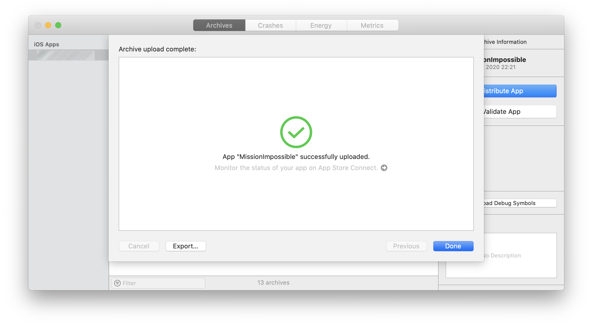
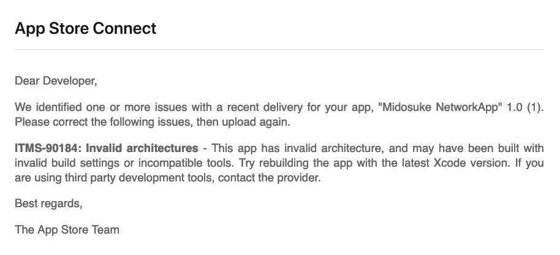
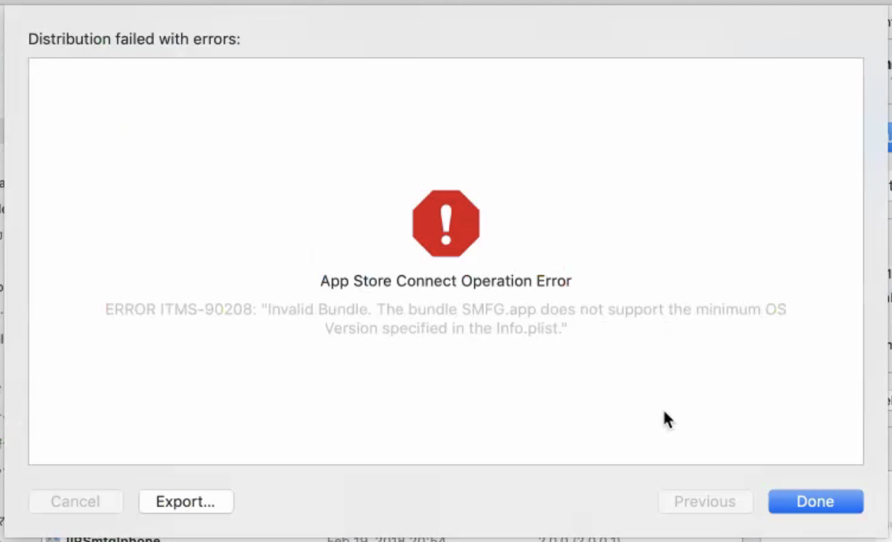
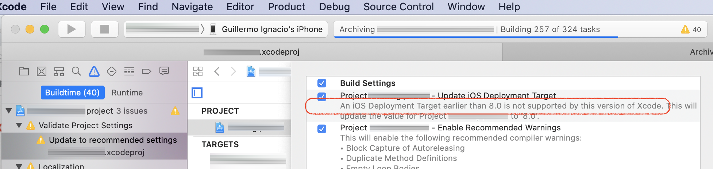
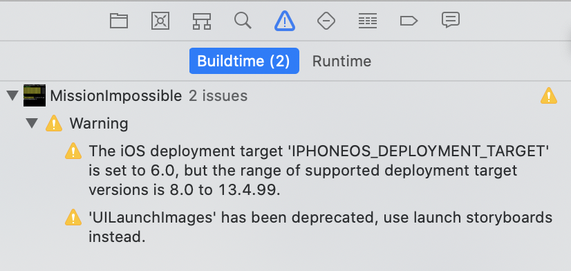

= MissionImpossible

Mission: Make an app that runs in iOS6 and is distributed via AppStore in 2020.

=== This was **not** possible.

Conclusion first: Xcode11 and Xcode10 require `IPHONEOS_DEPLOYMENT_TARGET` to be 8.0 or upper.

=== Some Notes

- With `IPHONEOS_DEPLOYMENT_TARGET = 6.0` build succeeds and submitting to the appstore apparently suceeds however a few minutes later binary is invalidated and email is sent with ITMS-90184 error:

[quote, AppStore Connect]
**ITMS-90184**: Invalid architectures - This app has invalid architecture, and may have been built with invalid build settings or incompatible tools. Try rebuilding the app with the latest Xcode version. If you are using third party development tools, contact the provider. 

- In Xcode10.1 distribution might fail with ITMS-90208 error. I think this happens when not all frameworks have the same `IPHONEOS_DEPLOYMENT_TARGET` number set.

[quote, Xcode Distribution]
ITMS-90208: Invalid Bundle. The bumdle ABC.app does not support the minimum OS Version specified in the Info.plist

- If project is old, upgrading to Xcode11 should suggest to change to `IPHONEOS_DEPLOYMENT_TARGET = 8.0`, as same as archive time warnings. My old project had so many warnings that I didn't realize of this at the beggining.

IMPORTANT:  App with `IPHONEOS_DEPLOYMENT_TARGET = 6.0` is able to compile and it is releasable via ad-hoc and run without any problems in iOS6. There is no apparent technical barrier in Xcode. The restriction is in AppStore. :)

